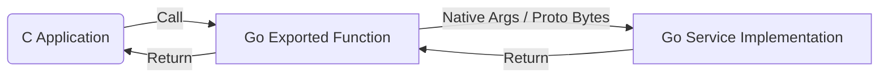

# 设计：RPC CGO 生成器 (Design: CGO Generator for RPC)

## 概述 (Overview)

`protoc-gen-ygrpc-cgo` 插件生成一个 Go 适配层，将 Go 实现的 RPC 服务导出给 C 使用。

## 架构 (Architecture)



## 数据传递与内存生命周期 (ABI & Lifecycle)

### 1. 核心 ABI 原则 (Core ABI Principles)
- **显式生命周期 (Explicit Lifecycle)**:
    - **C -> Go**: 必须传输 `(DataPtr, Length, FreeCallback)`。Go 在使用完数据后（通常在函数返回前）调用 `FreeCallback`。
    - **Go -> C**: 必须传输 `(DataPtr, Length, FreeCallback)`。Go 使用 `C.malloc` 分配 Pinned Memory，并返回标准 `free` 的包装函数。C 在使用完数据后调用 `FreeCallback`。
- **字符串编码 (String Encoding)**:
    - 所有的 `char*` 必须是 UTF-8 编码。
    - 禁止仅依赖 Null-Terminator，必须显式传递长度。

### 1.1 C 侧基础类型定义位置

所有 ABI 相关的 typedef 必须在生成的 Go 文件的 cgo 注释块（`import "C"` 之前的 `/* ... */`）中定义。

最小要求：

```c
typedef void (*FreeFunc)(void*);
```

以及所有使用 `FreeFunc` 的回调 typedef/函数原型，都必须位于该 typedef 之后。

### 1.2 len=0 的约定

对于输入的 `string/bytes` 三元组参数：

- 当 `len == 0` 时，视为“没有传入数据”。Go **不得**读取 `ptr`。
- 为避免泄漏：若 `ptr != NULL` 且 `free != NULL`，Go **必须**尽早调用 `free(ptr)`。

输出侧由 Go 分配并返回，`len == 0` 表示空字符串/空 bytes，但仍必须返回可调用的释放函数指针（允许返回一个对空指针无操作的 free wrapper）。

### 1.3 错误模型（统一）

- 所有导出函数以 `int` 返回错误结果：`0` 表示成功，非 `0` 表示失败并作为 **errorId**（全局唯一）。
- 错误信息不再通过各导出函数签名返回；统一通过一个全局导出函数查询：

```c
// 返回 0 表示找到了消息并输出；返回 1 表示未找到/已过期。
int Ygrpc_GetErrorMsg(int error_id, void** msg_ptr, int* msg_len, FreeFunc* msg_free);
```

- Go 侧维护一个全局 map：`errorId -> errorMsg(bytes)`，每条记录保存 3s，之后允许被清理。

### 1.4 Request Free 参数策略

- **默认**：导出函数签名不包含 request 的 `free` 参数（即 C 侧自行管理 request 内存；Go 不得释放）。
- **可选**：通过在 request message 上声明自定义 option，强制为该 message 生成包含 request `free` 的函数签名。
- **双版本**：当 option=3 时，同一个 RPC 需同时生成两种导出符号：
    - 默认名：不包含 request `free`（例如 `Service_Method` / `Service_Method_Native`）。
    - 建议后缀：`_TakeReq`（例如 `Service_Method_TakeReq` / `Service_Method_Native_TakeReq`）。

### 2. 模式 A：二进制模式 (Binary Mode) - 默认
- **适用场景**: 复杂消息对象，嵌套结构。
- **签名**: 接收序列化的 Protobuf 二进制 `(req_buf, req_len, req_free)`，返回 `(resp_buf, resp_len, resp_free)`。

### 3. 模式 B：原生模式 (Native Mode)
- **命名**: 接口函数名后缀为 `_Native` (例如 `Service_Method_Native`)。
- **适用场景**: Request/Response 仅包含基本类型（int, long, double, bool, string, bytes）且无嵌套 Message 的 RPC 方法。
- **限制**: 不支持 `optional` / `map` / `enum` / `repeated` / `oneof`。遇到这些字段时仅生成 Binary 接口。
- **映射规则**:
    - **基本数值**: 直接映射 (`int32` -> `int`, `int64` -> `long long`, `double` -> `double`)。
    - **String/Bytes**: 展开为三元组 `(char* ptr, int len, FreeFunc free)`。
- **实现逻辑**:
    - Go 导出函数接收展开后的参数。
    - Go 内部构造 Go Struct。
    - 调用业务 Handler。
    - 返回值同样展开。

**接口示例:**
假设 `rpc Login(LoginReq) returns (LoginResp)`
`message LoginReq { string user = 1; int32 age = 2; }`
`message LoginResp { int32 code = 1; string msg = 2; }`

```c
int MyService_Login_Native(
    // Input Fields
    const char* user, int user_len, FreeFunc user_free, // String 展开为三元组
    int age,                                            // Int 直接传递

    // Output Fields
    int* code,                                          // Int 输出
    char** msg, int* msg_len, FreeFunc* msg_free        // String 输出展开为三元组
);
```

### 4. 流式定义

流式接口同时支持 Binary 与 Native 两个版本：

- **Binary streaming**：`OnRead` 回调以 `(ptr,len,free)` 推送每条消息的 protobuf bytes。
- **Native streaming**：当消息满足 flat 限制时，`OnRead` 回调以“展开字段参数列表”的形式推送。

#### 生命周期与关闭

- streaming 导出函数不得阻塞调用线程（在 goroutine 内执行业务 handler）。
- 必须提供显式的 `Cancel/Close/Free` 入口以结束流并释放句柄。
- 必须定义回调线程模型：回调从 Go 发起调用，C 侧回调实现必须是线程安全的；同一 stream 上回调调用顺序必须是串行的（避免并发重入）。

## 内存管理细节 (Memory Management Details)
对于 `string` 类型的字段，无论是 Binary Mode 还是 Native Mode，都严禁简化处理：
1.  **Input String**: C 传入 `(ptr, len, free)`。Go 使用 `C.GoStringN(ptr, len)` 创建 Go String（发生拷贝）。Go 随即调用 `free(ptr)`。
2.  **Output String**: Go 计算结果。Go 调用 `C.malloc(len)` 分配内存。Go 将结果拷贝入 `malloc` 的内存。Go 返回 `(malloc_ptr, len, wrap_free)`。
