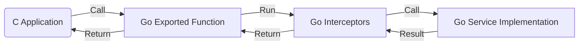

# 设计：gRPC CGO 生成器 (Design: CGO Generator for gRPC)

## 概述 (Overview)

`protoc-gen-ygrpc-cgo` 插件生成一个 Go 适配层，将 Go 实现的 gRPC 服务通过 CGO 导出给 C/C++ 程序调用。
架构本质上是将 gRPC 的 "HTTP/2 Transport" 替换为了 "CGO Interface"，但保留了 Interceptors 和 Handler 逻辑。

## 架构 (Architecture)



## 生成组件 (Generated Components)

对于包 `mypkg` 和服务 `MyService`：

1.  **`mypkg_cgo.go`**:
    - 定义 `//export Service_Method` 函数。
    - 内部负责：`C 数据 -> Proto 反序列化 -> 构造 Context -> 执行 Interceptor -> 调用 Handler -> Proto 序列化 -> 返回 C 数据`。
2.  **`mypkg.h`**:
    - 提供 C 调用的函数原型。

## 数据传递 (ABI)

### 1. Unary 定义 (同步调用)

**C 侧 (调用者):**

```c
// C 调用此函数发送请求并获取响应
int MyService_MyUnary(const char* req, int len, char** resp, int* resp_len, char** err_msg);
```

**Go 侧 (被调用者):**

```go
//export MyService_MyUnary
func MyService_MyUnary(reqBuf *C.char, reqLen C.int, respBuf **C.char, respLen *C.int, errPtr **C.char) C.int {
    // 1. Unmarshal reqBuf to Go Struct
    // 2. Setup Context (with metadata if needed)
    // 3. Compose Interceptor Chain: interceptor(ctx, req, info, handler)
    // 4. Call real implementation: impl.MyUnary(ctx, req)
    // 5. Marshal response -> *respBuf
    // 6. Return status code
}
```

### 2. 流式定义 (基于回调)

对于 Streaming RPC，C 是发起方 (Client)，Go 是服务方 (Server)。但因为是 CGO 调用，我们使用 **Callback** 模式来模拟 Go 向 C 推送数据。

**C 侧接口:**

```c
// 1. 启动流 (返回 Handle)
long MyService_Stream_Start(OnReadFunc onRead, OnDoneFunc onDone, void* user_ctx);

// 2. 发送数据 (C -> Go)
int MyService_Stream_Send(long handle, const char* data, int len);

// 3. 关闭发送 (EOF)
void MyService_Stream_Close(long handle);
```

**Go 侧实现:**

- `Start`: 启动一个 Goroutine。该 Goroutine 创建一个 `grpc.ServerStream` 的模拟实现（Adapter）。
- `Adapter`:
  - `SendMsg` (Go -> C): 调用 `OnRead` 回调。
  - `RecvMsg` (C -> Go): 从 Channel 读取数据（数据由 `Stream_Send` 写入）。
- **执行流**: Goroutine 启动后，执行 `StreamInterceptor`，最后调用 `impl.StreamMethod(srv, adapter)`。

## 并发模型

- Unary 调用在调用线程（C 线程）上同步运行（Go 运行时会将其调度到 M 上）。
- Streaming 调用在 Go 创建的新 Goroutine 上异步运行。C 回调也会在该 Goroutine 上执行，因此 C 的回调函数必须注意线程安全。

## 内存管理

- **Go -> C (Params)**: 指针仅在函数/回调生命周期内有效。
- **Go -> C (Return)**: 如果 Go 分配了 C 内存（如 `respBuf`），C 负责 `free`。
