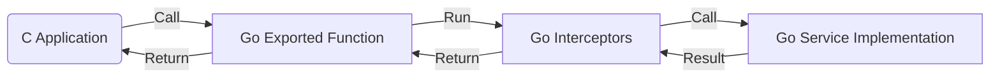

# 设计：RPC CGO 生成器 (Design: CGO Generator for RPC)

## 概述 (Overview)

`protoc-gen-ygrpc-cgo` 插件生成一个 Go 适配层，将 Go 实现的 RPC 服务（gRPC/ConnectRPC）通过 CGO 导出给 C/C++ 程序调用。
架构本质上是将标准的 Transport 层替换为了 "CGO Interface"，但保留了 Interceptors 和 Handler 逻辑。

## 架构 (Architecture)



## 生成组件 (Generated Components)

对于包 `mypkg` 和服务 `MyService`：

1.  **`mypkg_cgo.go`**:
    - 定义 `//export Service_Method` 函数。
    - 内部负责：`C 数据 -> 反序列化 -> 构造 Context -> 执行 Interceptor -> 调用 Handler -> 序列化 -> 返回 C 数据`。
2.  **`mypkg.h`**:
    - 提供 C 调用的函数原型。

## 数据传递 (ABI)

### 1. Unary 定义 (同步调用)

**C 侧 (调用者):**
```c
// C 调用此函数发送请求并获取响应
int MyService_MyUnary(const char* req, int len, char** resp, int* resp_len, char** err_msg);
```

**Go 侧 (被调用者):**
```go
//export MyService_MyUnary
func MyService_MyUnary(reqBuf *C.char, reqLen C.int, respBuf **C.char, respLen *C.int, errPtr **C.char) C.int {
    // 1. Unmarshal reqBuf to Go Struct
    // 2. Setup Context (with metadata if needed)
    // 3. Compose Interceptor Chain (gRPC/Connect adapter)
    // 4. Call real implementation: impl.MyUnary(ctx, req)
    // 5. Marshal response -> *respBuf
    // 6. Return status code
}
```

### 2. 流式定义 (基于回调)

对于 Streaming RPC，C 是发起方 (Client)，Go 是服务方 (Server)。

**C 侧接口:**
```c
// 1. 启动流 (返回 Handle)
long MyService_Stream_Start(OnReadFunc onRead, OnDoneFunc onDone, void* user_ctx);

// 2. 发送数据 (C -> Go)
int MyService_Stream_Send(long handle, const char* data, int len);

// 3. 关闭发送 (EOF)
void MyService_Stream_Close(long handle);
```

**Go 侧实现:**
- `Start`: 启动一个 Goroutine。该 Goroutine 创建一个流适配器（Adapter）。
- `Adapter`:
    - 封装了底层的数据交换（调用 `OnRead` / 读取 Channel）。
    - 向上层 Handler 暴露标准流接口（如 `grpc.ServerStream` 或 `connect.ClientStream`，视具体实现而定）。
- **执行流**: Goroutine 启动后，执行流式拦截器，最后调用实现方法。

## 中间件适配

由于 gRPC 和 ConnectRPC 的中间件签名不同，生成的代码应提供适配层或生成特定于框架的适配代码（通过插件参数控制生成 `grpc` 适配还是 `connect` 适配）。
默认设计应确保 CGO 接口保持稳定，不随 Go 侧框架变化。

## 并发与内存
- **并发**: Streaming 调用在 Go 创建的新 Goroutine 上异步运行。C 回调也会在该 Goroutine 上执行。
- **内存**: Go 分配给 C 的内存需由 C 释放。
